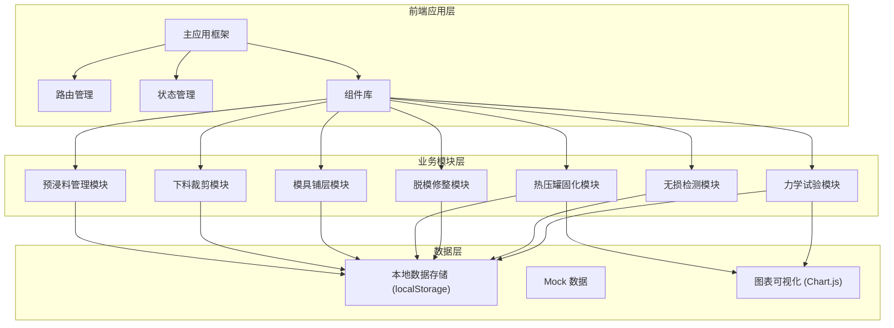
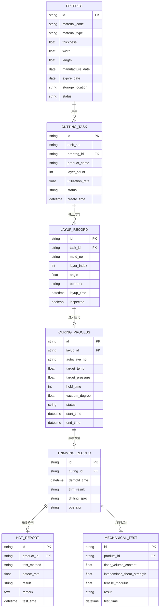

## 1. 架构设计

## 2. 技术描述

- **前端框架**：React 18 + TypeScript
- **构建工具**：Vite 5
- **样式方案**：TailwindCSS 3 + CSS 变量
- **图表库**：Chart.js + react-chartjs-2
- **路由管理**：React Router v6
- **图标库**：Lucide React
- **数据存储**：localStorage（本地持久化）
- **UI 组件**：自定义工业风组件库

## 3. 路由定义

| 路由 | 页面 | 用途 |
|------|------|------|
| /dashboard | 工作台 | 生产数据概览、待办任务 |
| /prepreg | 预浸料管理 | 预浸料入库、冷藏管理、出库 |
| /cutting | 下料裁剪 | 裁剪任务、排样管理 |
| /layup | 模具铺层 | 铺层记录、角度管理 |
| /curing | 热压罐固化 | 温压曲线、固化监控 |
| /trimming | 脱模修整 | 脱模、修整、钻孔记录 |
| /ndt | 无损检测 | 超声检测、缺陷分析 |
| /mechanical | 力学试验 | 性能测试、数据管理 |

## 4. 数据模型

### 4.1 数据模型定义

### 4.2 数据存储说明

- 使用 localStorage 进行本地数据持久化
- 每个模块独立管理其数据状态
- 提供数据导入导出功能（JSON 格式）
- 初始化时加载 Mock 数据用于演示

## 5. 组件设计

### 5.1 公共组件
- Sidebar：左侧导航栏
- Header：顶部状态栏
- DataCard：数据卡片组件
- Table：数据表格组件
- Modal：弹窗组件
- Form：表单组件
- ProgressBar：进度条组件
- StatusBadge：状态标签组件

### 5.2 业务组件
- PrepregList：预浸料列表
- CuttingChart：排样图表
- LayupAngleChart：铺层角度图
- CuringCurveChart：温压曲线图
- NdtScanImage：超声扫描图
- StressStrainChart：应力应变曲线图
